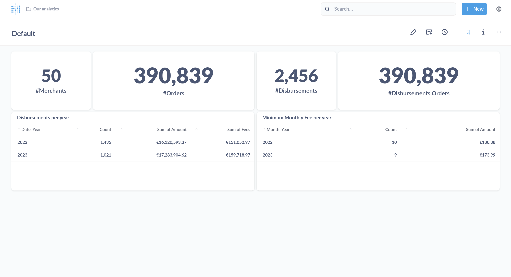

# seQura backend coding challenge

- [Challenge](./CHALLENGE.md)
- [Questions-Answers](./Questions-Answers.md)
- [ADRs](./doc/adr/)

## System requirements

- Java 17
- Docker (It needs to be Docker, other container systems like Podman might not work due to specific Testcontainers
  configuration)
- If using VS Code, you will need the [httpYAC](https://marketplace.visualstudio.com/items?itemName=anweber.vscode-httpyac) extension to run the `application.http` requests.
  - In case of using IntelliJ and alike IDE, it comes out of the box.

## Challenge outcome

| Year | 	Number of disbursements | 	Amount disbursed to merchants | 	Amount of order fees 	 | Number of monthly fees charged (From minimum monthly fee) | 	Amount of monthly fee charged (From minimum monthly fee) |
|------|--------------------------|--------------------------------|-------------------------|-----------------------------------------------------------|-----------------------------------------------------------|
| 2022 | 	1435                    | 	16.120.593,37 €               | 	151.052,97 €           | 	10 	                                                     | 180.38 €                                                  |
| 2023 | 	1021                    | 	17.283.904,62 €               | 	159.718,97 €           | 	9 	                                                      | 173.99 €                                                  |

## Running the solution in local

**Stateless solution**:

- `./gradlew bootTestRun`

This will start the application with a Postgres Container automatically on a random port.

**Stateful solution**:

- `STATEFUL=true ./gradlew bootTestRun`

**Stateful with Metabase**:

- `STATEFUL=true METABASE=true ./gradlew bootTestRun`

It requires to be stateful application in order to use Metabase.

### Postgres' connection information:

- Port: See `docker ps` - In case of stateless, the port will be random. In case of stateful, it will be `5555`.
- Database: `test`
- User: `test`
- Password: `test`

### Metabase credentials:

- Host: http://localhost:3000
- Email: sequra@example.com
- Password: seQura23

Dashboard with the Challenge results: http://localhost:3000/dashboard/1-default

## Executing the challenge in local

Open the file [`application.http`](application.http) that you can find in the root directory,
and execute the requests in order.

You will see some messages logs updating the context while ingesting the `orders.csv`.

And you will be able to inspect the result when it finishes at `http://localhost:8080/disbursements/by-year`

You can see the progress at Metabase in case of using the stateful solution.