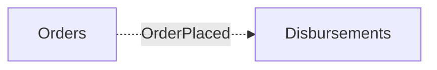
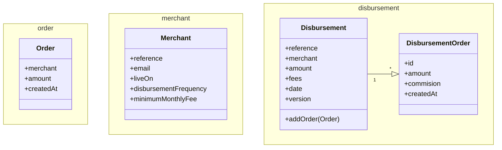

# 5. First design iteration

Date: 2023-11-03

## Status

Superseded by [7. second disbursement iteration](0007-second-disbursement-iteration.md)

## Context

I needed to scaffold the application with the main concepts of the Challenge.

The main goal is to create the basics to explore which are the core decisions
that will impact the solution design and its performance.

## Decision

I decided to create the following domain concepts:

- Orders
- Merchants
- Disbursements

Those three _domains_ have different properties at the first glance.

- **Orders**: We need to guarantee that they are stored when we receive them.
Those operations **MUST NOT** be dependent on the other domains to ensure system availability and reliability.
On the other hand, this domain will not contain much logic
- **Merchants**: It is a domain that doesn't change often. CRUD operations look good enough in this case.
- **Disbursements**: We will dedicate the most effort here, and it will be business logic intensive.

In order to ensure that `orders` table do not suffer from random access due to `disbursements` operations,
we will create a mechanism via Spring Boot internal Event Publisher to decouple both.

That communication will be asynchronous.

This way, in case of need or failure of the `disbursements` process, it won't affect
storing the orders. Being able to mitigate the failure after without affecting clients.

## Consequences

The main consequence is that we will have duplication of data between `orders` and `disbursements`.
We don't expect that to be a key problem.

The other unknown is the design of `Disbursement` entity will cause on database concurrency updates.

That's why we add the `version` field to the entity. We will use it to ensure that we are not losing data.

We will create a test to ensure that it doesn't happen.