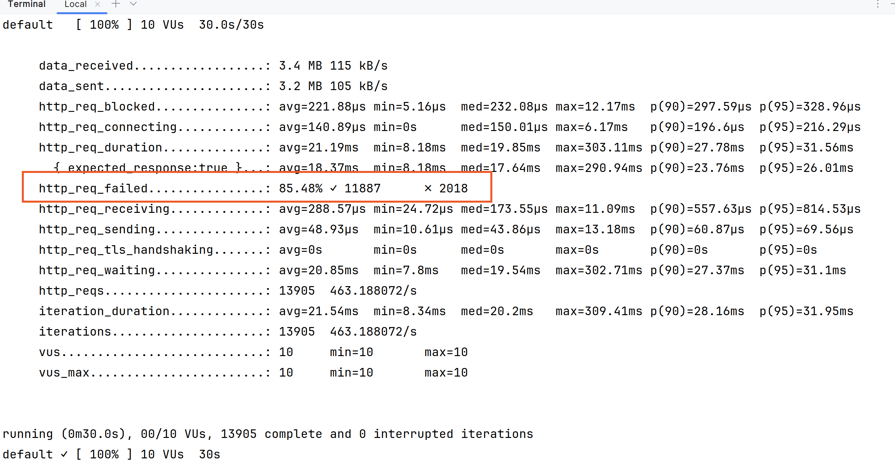

# 6. Concurrency problem detected

Date: 2023-11-03

## Status

Accepted

## Context

We detected that the `Disbursement` entity design could lead into a concurrency problem.

## Decision

We designed a concurrency test with the [K6][k6] tool to verify if the problem does exist.

We will test the following scenario:

- 10 concurrent users.
- Creating orders for the same date and Merchant.
- Run the test for 30 seconds.

[Concurrency test source code](../../src/test/k6/disbursement-concurrency.js)

Running the concurrency test in the main project folder with:

In order to verify the problem with the `Disbursement` entity design, we disabled
the `@Async` event handler for `OrderPlaced` event.

```bash
docker run --network=host --rm -i grafana/k6 run --vus 10 --duration 30s - <src/test/k6/disbursement-concurrency.js
```
## Consequences



We detected that the problem exists.

With 10 concurrent users for 30 seconds, we got the next numbers:

- 13905 orders created.
- 11887 succeed.
- 2018 failed due to `PSQLExecption`.

It means only the 85.48% of the `disbursement` operations were successful.

In concrete, we got:

```text
org.postgresql.util.PSQLException: ERROR: could not serialize access due to read/write dependencies among transactions
  Detail: Reason code: Canceled on identification as a pivot, during write.
```

This causes a problem because of two specific challenge requirement:

- All orders must be disbursed precisely once.
- You should consider this code ready for production as it was a PR to be reviewed by a colleague. Also, commit as if it were a real-world feature


[k6]: https://k6.io/