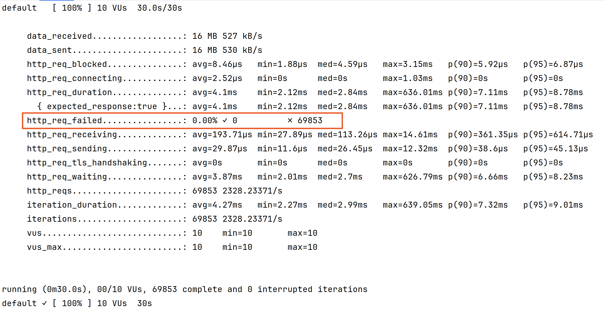
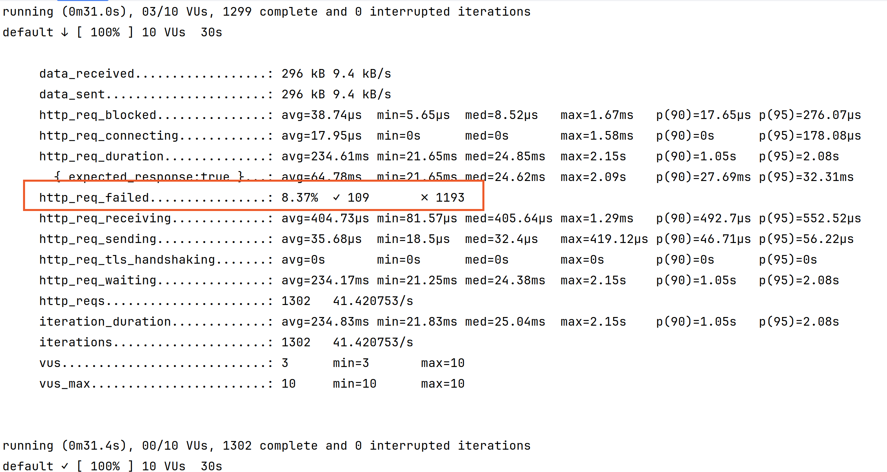

# 7. second disbursement iteration

Date: 2023-11-03

## Status

Superseded by [8. third disbursement iteration](0008-third-disbursement-iteration.md)

## Context

I found that the way `Disbursement` was designed didn't suit the requirements.

See [ADR 6. first disbursement iteration](./0006-concurrency-problem-detected.md) for more details.

## Decision

**New orders**

Instead of being `Disbursement` a domain entity, I will create `DisbursementOrder` as a domain entity that
will contain the necessary information to create a `Disbursement` view.

The key reason of keeping `DisbursementOrder` and `Order` separated is to add the disbursement logic to one entity without
polluting the other.

We calculate and store the commission in each Order to ensure that, if in the future we modify those rules, we can
keep track of what happened in the past for reporting/auditing purposes.

**Ingesting order.csv**

On the other hand, ingesting the `order.csv` file do not require that degree of concurrency.

We can take advantage of non-concurrent execution and calculate the `Disbursements` as we ingest the `Orders`.

So, we will keep the process simple in this scenario.

## Consequences

Disbursements will be calculated at read time instead of write time as before.

- Disbursement is a view instead of a domain entity.
- DisbursementOrder is a domain entity that contains the necessary information to create a Disbursement view.

## Outcome

We can see how the concurrency problem has been solved.

- 0% failure rate.
- 69853 orders processed in 30 seconds, that's several times faster previous solutions.

## Alternatives considered

**Batch job**

Instead of communicating the Orders with events to trigger the communication to react on the event, we could use a batch job to calculate the disbursements once every X time.

Indeed, it looks like a good solution, but it has several drawbacks:

- We don't have real time visibility of our business needs.
- We might reach a point that we cannot calculate everything between 0:00 and 8:00 UTC, but it's a problem for the future in case of implementing this solution.

**Introduce a streaming system**

Keep the system as it is but instead of using the Spring Boot event publishing system, use a system like Kafka.

This would be a good solution if we want to achieve a real time system, and we could scale the disbursement process cross multiple readers.

BUT, at this point, it is an overkill.

**Use @Retryable annotation**

We could use the [@Retryable](https://docs.spring.io/spring-retry/docs/api/current/org/springframework/retry/annotation/Retryable.html) annotation to retry the operation in case of failure.

It would improve the concurrency problem, but it would not solve it completely.

We can see how it improved the failure rate to 8% against the 85% of the previous method, but it has several drawbacks:

- The server has become orders of magnitude slower. 1300 requests vs 13000 requests. Ten times slower.
- No guarantee that all orders being processed exactly once.